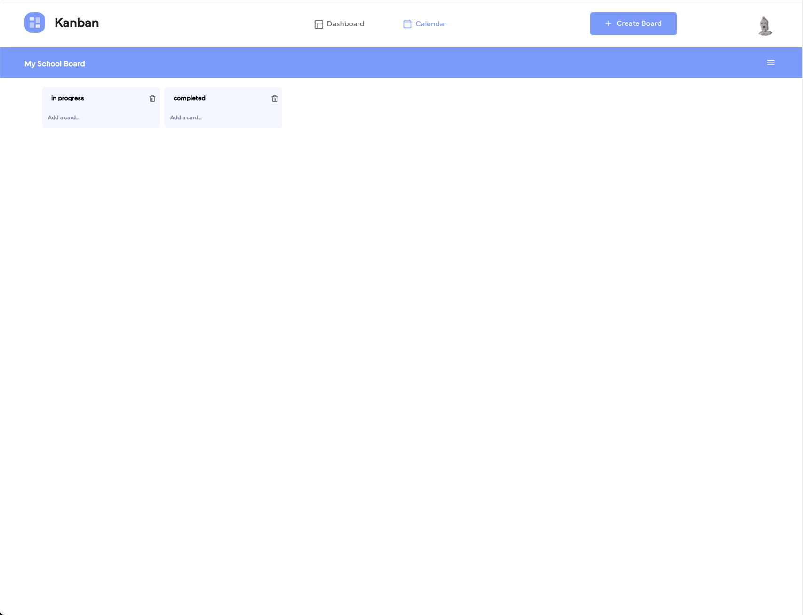
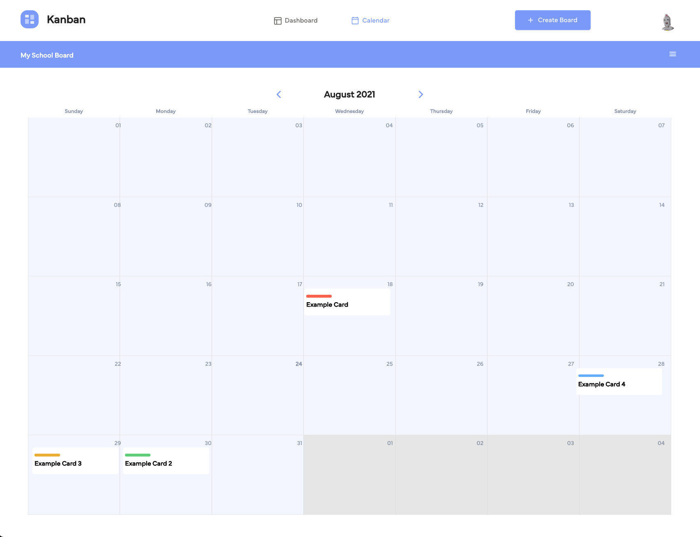

## Project Name

This is a little description about your project.

**Tech Stack:** MongoDB, Express.js, React.js, Node.js, Typescript

**Contributors**: [Hector Palacios](https://github.com/hapalacios) - [Igor Cunha](https://github.com/iigorcunha) - [Robert Orazu](https://github.com/Robertito1) - [Rishabh Bajpai](https://github.com/Rishiswaz)

---

### Getting Started

1. Clone or download repository

---

## Server

1. Go into the server directory `cd server`
2. Run `npm install` to install packages
3. Create your environment variable (.env) file
4. Run `npm run dev` to start the server

---

## Client

1. Go into the client directory `cd client`
2. Run `npm install` to install packages
3. Run `npm start` to start the client side

---

### Demo

1. Registration. Users will be able to create a new account using their email and password

2. Dashboard. Here is a description about what a user can expect to see

3. Card. Here is an short video as example how to create cards.

4. Card Detail. Here is a video example what you can do inside of a card. 

5. Card with deadline. 

6. Column. Here is other example video how to create column and edit their titles.

7. Calendar view. 

